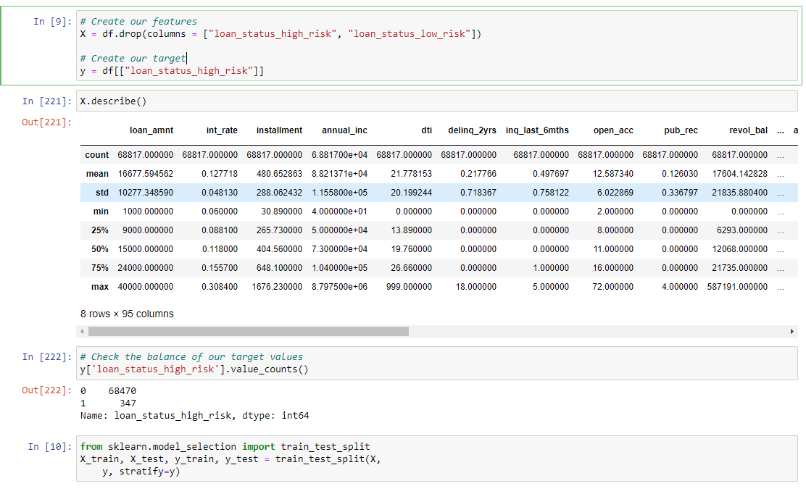
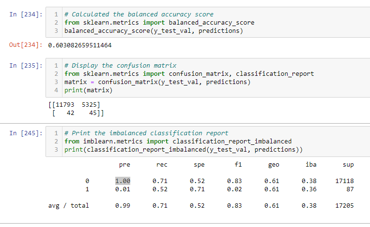
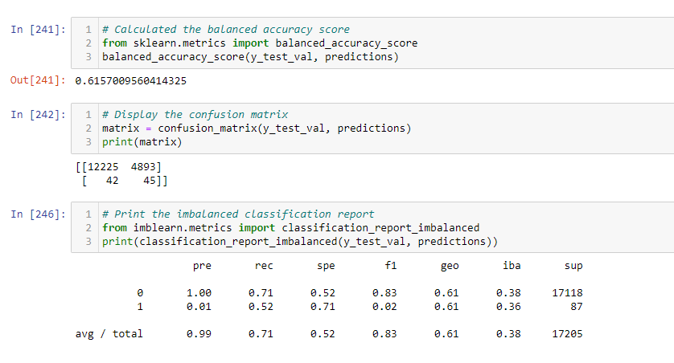
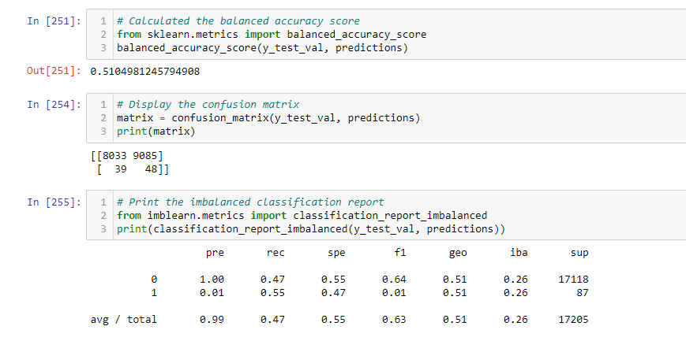
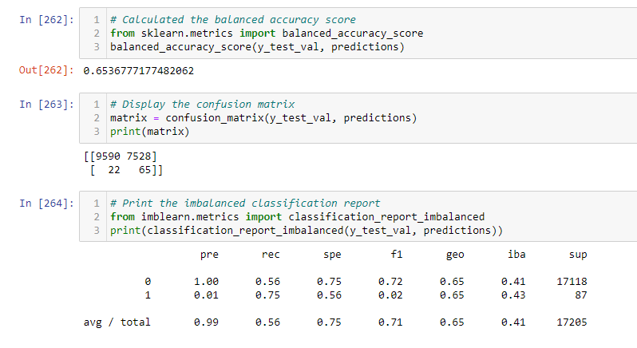
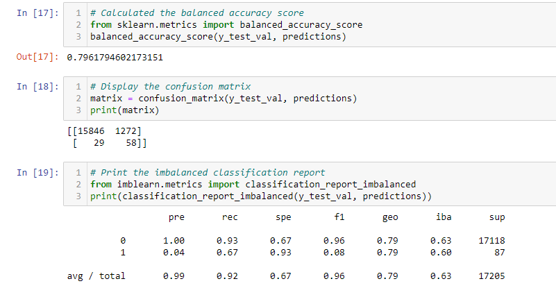
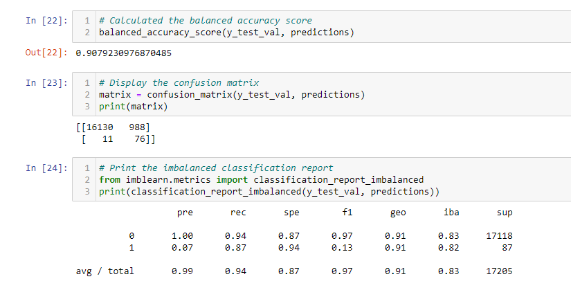

# Credit_Risk_Analysis
Analyzing credit risk in a LendingClub dataset using SMOTE oversampling, naive oversampling, clustered centroids undersampling, SMOTEEN oversampling/undersampling, balanced random forest, and EasyEnsemble Classifier machine learning algorithms

## Overview
Working from an anonymized dataset of LendingClub borrowers, I have used several different machine learning algorithms to gauge thecredit risk of borrowers. Credit risk datasets typically contain far more low risk borrowers than high risk borrowers, and this dataset is no exception. Because of this, the key distinction between the six different algorithms are the methods employed in compensating for the relative paucity of high risk borrowers. (After doing some initial data cleaning, there were 347 high risk borrowers and 68,470 non-high risk borrowers. I will compare model performance using naive oversampling, SMOTE oversampling, Clustered Centroids undersampling, SMOTEENN oversampling/undersampling (combined), balanced random forest, and EasyEnsemble Classifier. 

### Resources
Software/languages: Jupyter Notebook, 
Python packages: numpy, Pandas, SKLearn, IMBLearn

[Data:](https://github.com/perryabdulkadir/Credit_Risk_Analysis/blob/main/Resources/LoanStats_2019Q1.csv) LoanStats_2019Q1.csv 


## Analysis 

### Cleaning the Data

I started by loading in the data, dropping null columns and rows, removing issued loans, converting the interest rate data type, categorizing target column values as either low risk or high risk. 

```
# Load the data
file_path = Path('Resources/LoanStats_2019Q1.csv')
df = pd.read_csv(file_path, skiprows=1)[:-2]
df = df.loc[:, columns].copy()

# Drop the null columns where all values are null
df = df.dropna(axis='columns', how='all')

# Drop the null rows
df = df.dropna()

# Remove the `Issued` loan status
issued_mask = df['loan_status'] != 'Issued'
df = df.loc[issued_mask]

# convert interest rate to numerical
df['int_rate'] = df['int_rate'].str.replace('%', '')
df['int_rate'] = df['int_rate'].astype('float') / 100


# Convert the target column values to low_risk and high_risk based on their values
x = {'Current': 'low_risk'}   
df = df.replace(x)

x = dict.fromkeys(['Late (31-120 days)', 'Late (16-30 days)', 'Default', 'In Grace Period'], 'high_risk')    
df = df.replace(x)

df.reset_index(inplace=True, drop=True)

df.head()
```
I then dummified categorical variables. 

```
df = pd.get_dummies(df, columns=["home_ownership", "verification_status", "initial_list_status", "application_type", "hardship_flag", "debt_settlement_flag", "issue_d", "next_pymnt_d", "loan_status", "pymnt_plan"])
```
I repeated the same process for the ensemble model notebook.

### Splitting the Data in Training and Testing Data Sets
I split the data into training and testing sets using the code below. 


I repeated the same process for the ensemble model notebook.

## Results

* **Naive Random Oversampling**



The naive random oversampling method resulted in a balanced accuracy score of 0.60, an average precision score of 0.99, and an average recall score of 0.71. 

* **SMOTE Oversampling**


The SMOTE oversampling method resulted in a balanced accuracy score of 0.62, an average precision score of 0.99, and an average recall score of 0.71. 

* **Clustered Centroids Undersampling**


The Clustered Centroids undersampling method resulted in a balanced accuracy score of 0.51, an average precision score of 0.99, and an average recall score of 0.47. 

* **Combination (Over and Under) Sampling with SMOTEENN**


The SMOTEENN combination sampling method resulted in a balanced accuracy score of 0.65, an average precision score of 0.99, and an average recall score of 0.56. 

* **Balanced Random Forest Classifier**


The balanced random forest classifier method resulted in a balanced accuracy score of 0.80, an average precision score of 0.99, and an average recall score of 0.92. 

* **Easy Ensemble AdaBoost Classifier**


The Easy Ensemble AdaBoost Classifier method resulted in a balanced accuracy score of 0.91, an average precision score of 0.99, and an average recall score of 0.94. 


## Summary and Recommendation

To begin with, we should clarify which metric is most important between precision and recall. For this use case, recall (sensitivity) is more important than precision. It is a better scenario for the algorithm to flag a good applicant as high risk, only to have a manual review approve them (false positive) than it is to have the algorithm approve a high risk applicant (false negative). 

I recommend two models, each of which may be useful depending on the use case. The Easy Ensemble AdaBoost Classifier had the highest balanced accuracy score (0.91), had a precision score of 0.99, and had a recall score of 0.91. Therefore, this is the model to use if overall model performance is the greatest concern. The Balanced Random Forest Classifier performed a bit worse, with an accuracy score of 0.80, a precision score of 0.99, and an average recall score of 0.92. The benefit of this model, however, is that it is more understandable for humans as it is easy to see which features were most important to the model performance, using the code below.

```
imp = dict(zip(*[X.columns.tolist(), random_forest.feature_importances_]))
{k: v for k, v in sorted(imp.items(), key=lambda item: item[1], reverse=True)}
```

Additionally, while the balanced accuracy score is lower than the Easy Ensemble AdaBoost Classifier, its sensitivity is actually just slightly higher. If this is the most important feature for our analysis, then the random forest method has a slight edge. 

Both of these models could be valuable in the right situation. Initially, I suspected that the EasyEnsemble model may have been overfitted; that is, it reflects the idiosyncracies of this dataset but would not perform well if applied to new data. I checked for overfitting by seeing if model performance was significantly different on the training dataset that the model had seen before. On the training dataset, the balanced accuracy score was slightly higher at 0.96, the precision score was slightly higher, at 1.0, and the recall score was slightly higher at 0.94. The difference in performance is not so great that I believe overfitting is happening, but it would still be worthwhile to try this model on more data, if available, to test its performance.
